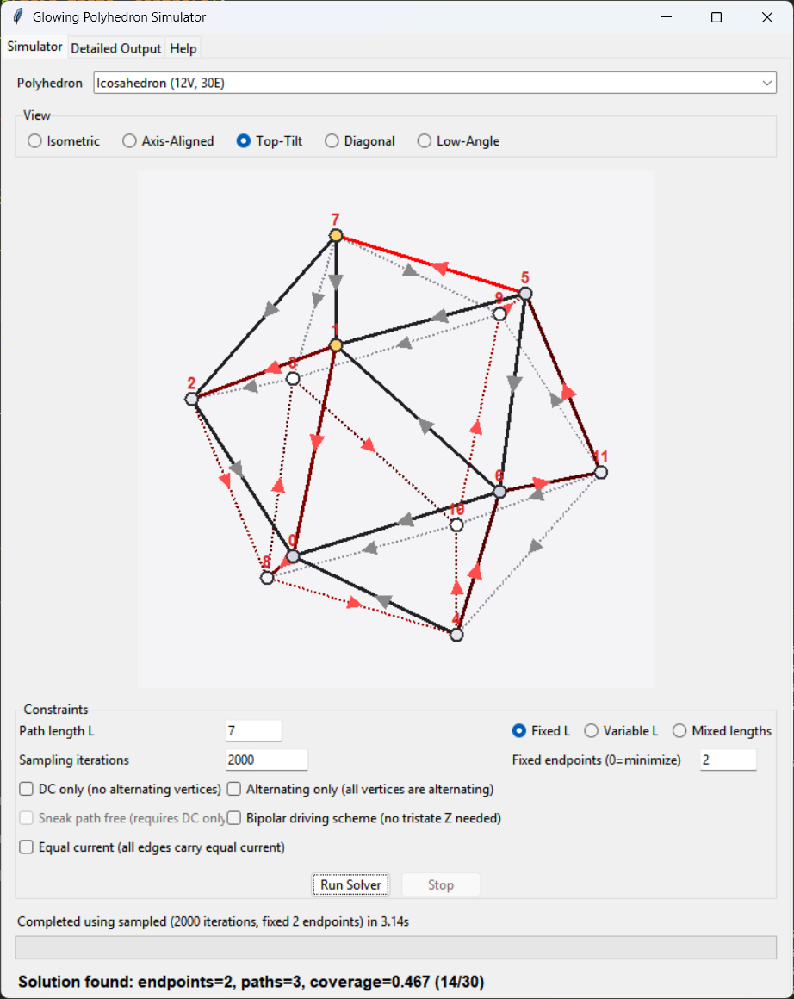

# GlowPoly

Interactive LED path optimization for 3D polyhedra. Finds optimal electrical paths that minimize endpoints (vertices that have to be connected to a power supply) while maximizing edge coverage.



## Installation

Requires Python 3.10+

```bash
git clone https://github.com/cpldcpu/GlowPoly.git
cd GlowPoly
```

## Usage

```bash
python glowing_polyhedron_sim.py
```
