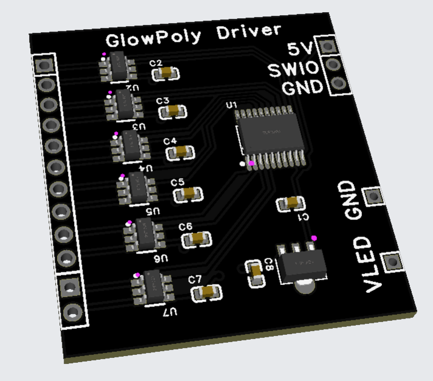
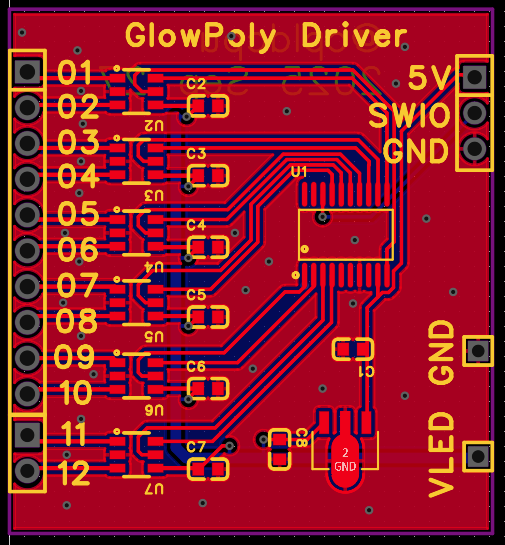

# Hardware

PCB design files and documentation for the GlowPoly LED driver board.

  
  

## Files

- `GlowPoly_Schematic_2025-09-27.pdf` - Circuit schematic
- `ProPrj_GlowPolyDriver_2025-09-27.epro` - EasyEDA project file
- `driver_pcb_render.png` - 3D PCB render
- `pcbtopdown.png` - PCB top view layout

## Overview

The driver board allows driving up to 12 feedpoints (vertices) on a polyhedron. It is controlled by a CH32V003. Each channel can be set to Anode, Cathode, or High-Z (with some constraints), allowing implementation of the various electrical configurations supported by the GlowPoly simulator software.

H-Bridge motor drivers are used to allow driving up to 10V (three strings in series). A LDO supplies 5V for the MCU.

---

## LED Filaments

The LED filaments used in this project are COB (Chip-on-Board) LED strips:

  
  
  

### Physical Properties

- **Construction:** ~16 LED dies connected in parallel on a phosphor-coated glass substrate
- **Typical length:** ~38mm
- **Electrical:** Current flows only in one direction (diode behavior)

### Measured Characteristics

| I [mA] | V | ALS | Radiance (vs 100mA) |
|--------|------|------|---------------------|
| 10 | 2.59 | 650 | 0.11 |
| 20 | 2.64 | 1279 | 0.22 |
| 30 | 2.68 | 1900 | 0.32 |
| 40 | 2.72 | 2503 | 0.42 |
| 50 | 2.75 | 3096 | 0.52 |
| 60 | 2.79 | 3675 | 0.62 |
| 70 | 2.82 | 4255 | 0.72 |
| 80 | 2.85 | 4814 | 0.82 |
| 90 | 2.88 | 5357 | 0.91 |
| 100 | 2.91 | 5899 | 1.00 |
| 110 | 2.94 | 6431 | 1.09 |
| 120 | 2.97 | 6961 | 1.18 |
| 130 | 3.00 | 7468 | 1.27 |
| 140 | 3.03 | 7975 | 1.35 |
| 150 | 3.06 | 8477 | 1.44 |

### Key Observations

- Forward voltage increases from ~2.6V at 10mA to ~3.1V at 150mA
- Radiance is nearly linear with current (makes brightness control predictable)
- At 100mA reference current, the voltage is ~2.9V
- When stacking filaments in series: voltages add up (3 × 3V = 9V)
- When running in parallel: current divides equally
