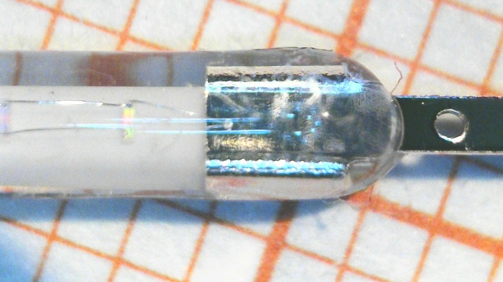

# LED Filaments

**Contents:** [Overview](#overview) · [Electrical Characteristics](#electrical-characteristics) · [Soldering Tips](#soldering-tips)

## Overview

I used 38mm COB (Chip-on-Board) LED strips from Aliexpress for this project. They are similar to those found inside vintage-style bulbs. Each filament has 16 LED dies wired in parallel on a phosphor-coated ceramic substrate. They come in a number of different colors. Typical prices are $0.10-$0.20 per filament depending on volume. There are a number of different vendors.

  
  
  

## Electrical Characteristics

I connected a filament to a bench supply and measured voltage and light output (via an ambient light sensor) across the operating range.

  

| Current (mA) | Voltage (V) | Relative Radiance |
|:------------:|:-----------:|:-----------------:|
| 10  | 2.59 | 0.11 |
| 50  | 2.75 | 0.52 |
| 100 | 2.91 | 1.00 |
| 150 | 3.06 | 1.44 |

Forward voltage increases from about 2.6V at 10mA to 3.1V at 150mA. Radiance scales linearly with current, there is very little droop even when driving the filaments beyond the rated current of 100mA.
This means that brightness uniformity comes down to current uniformity. Getting equal current through every edge of a complex polyhedron is non-trivial, and that's really the whole point of this project.

---

## Soldering Tips

Building these polyhedra takes patience. The ceramic carriers are very fragile—never bend or twist the filaments. That said, even if one cracks, it usually still works; you just lose some mechanical strength.

Pre-tin both ends of each filament first. When joining, heat only the joint itself—keep it brief and local to avoid melting nearby connections. Larger object can easily turn into an endurance test of your patience, as soldering one vertex often causes another to come apart. This is normal. 

I found it easiest to start with planar shapes (triangles, squares, etc.) and then join them into 3D structures piece by piece. I did most of my builds by eyeballing angles, but jigs would definitely help ensure accuracy.

The 3D webviewer is useful as a structural reference while building.

