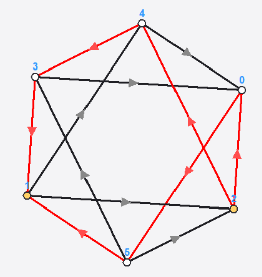
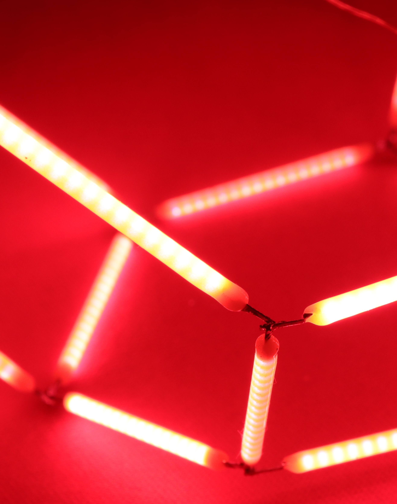
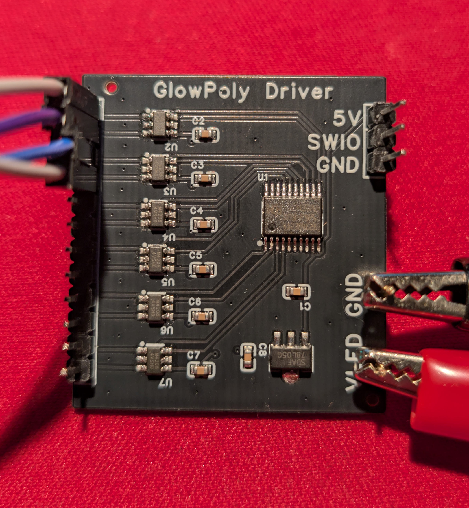
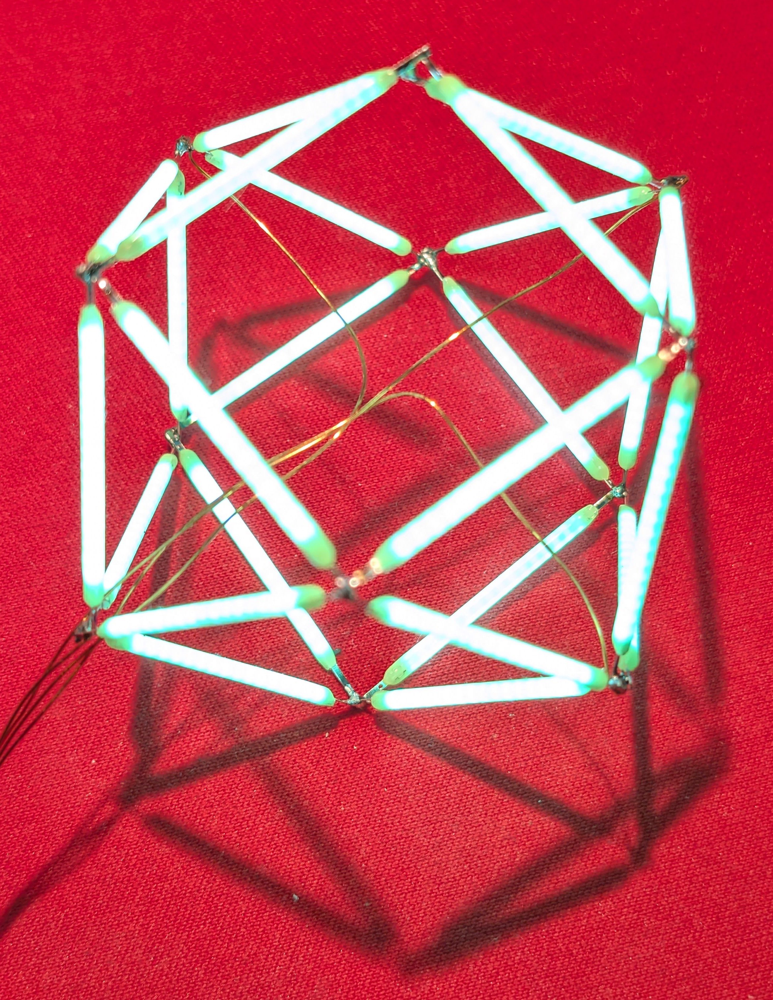

# Glowing 3D Objects from LED Filaments

*Wireframe polyhedra made entirely from LED filaments, using graph theory to optimize connection and driving strategies.*

It all began with [a video by Huy Vector](https://www.youtube.com/watch?v=zocqV4TZ4qI)[^1] that someone posted on cnlohr's Discord server: A brass wire cube with a battery and four white LED filaments. I was immediately fascinated by the idea of building objects out of LED filaments. 

But of course, in my mind, this quickly turned into a logic puzzle: Why only four filaments when a cube actually has twelve edges? What if we would build the entire cube out of LED filaments? How could we ensure that all edges light up properly? What about more interesting shapes? 

Turns out this is a deep rabbit hole. In this article, I summarize some of my findings and intermediate steps.

## LED Filaments

The LED filaments that most commonly found in asian online market places typically measure 38mm in length with a forward voltage of 3V. Each filament contains 16 blue LED dies mounted on a thin white ceramic substrate. All LED dies are connected in parallel. Metal contacts at both ends are serving as anode and cathode. The entire assembly is encapsulated in a silicone coating laced with a phosphor, which converts the blue light into a broader spectrum of colors. Blue filaments use a clear encapsulation without phosphor and allow us to see the individual LED dies inside.

The filaments are diodes: Current can only flow in one direction, from anode to cathode. When a forward voltage of about 3V is applied, the filament lights up, with brightness proportional to the current flowing through it (typically 10-100 mA). When multiple filaments are connected in series, their forward voltages add up. Connecting them in parallel divides the current among them. I stored a more detailed characterization [here](../filaments/).

## Building Wireframe Shapes and Formalizing the Problem

With some care (and a lot of patience), the metal ends of the filaments can be soldered together to form complex 2D and 3D shapes. This can be used to build amazing glowing objects. The challenge is that also the electrical circuit is defined by how the filaments are connected in the object; a mesh that results in a mechanically stable and visually interesting structure may not necessarily represent a circuit that allows all filaments to light up properly. 

How to solve this? Let's start with a simple 2D object. The photo below shows a simple square made from four LED filaments. A constant current supply is attached to the top and bottom joint, allowing all filaments to light up. The left and right (blue and red) part of the circuit form two parallel paths for the current to flow from top to bottom, while the filaments on each side are in series. The total voltage drop is around 6V, and each filament receives about half the total current.

  

  

As shown on the right figure, the structure can be represented as a graph: Each junction corresponds to a vertex, and each filament corresponds to a connection between two vertices, a directed edge. Yellow markers indicate the feeding points where current is injected. This abstraction allows us to analyze the relationship between the geometry and its electrical properties using [graph theory](https://en.wikipedia.org/wiki/Graph_theory)[^2].

### What do we actually want to achieve?

Given a wireframe object made from LED filaments, what do we actually want to achieve? Two obvious objectives are:

1) All edges shall light up.
2) We want to minimize the number of feeding points.

For example, the square above meets the first condition with two feeding points. Things get quickly more complicated when we move to more complex objects. 

Assuming with have E edges (filaments) and V vertices (junctions),
there are $2^E$ possible ways to orient the edges. For each orientation, there are $3^V$ possible combinations to attach feeding points (each vertex can be anode, cathode, or unconnected). Searching through all combinations quickly becomes infeasible for larger objects. 

Even a simple cube with 12 edges and 8 vertices has $2^{12} = 4096$ possible edge orientations and $3^8 = 6561$ feeding point combinations with a total search space of over 26 million possibilities.

Luckily it is possible to limit the search space by introducing additional constraints. First, we can restrict the allowed path length $L$ between feeding points. This is desirable since then the voltage drop is constant between all feeding points. Given this constraint, we usually want to optimize for minimum feeding points, but I found that it often helps to set a target number of feeding points and search for valid configurations that meet this target. Note that this reduces the search space from $3^V$ to $\binom{V}{P} \cdot 2^{P}$, where $P$ is the number of feeding points.

3) The path length for all circuits between feeding points shall be exactly $L$ edges. 
4) The number of feeding points shall be exactly $P$ (or be minimized).

## The Cube

Let's explore a simple 3D object: the cube ($V=8$, $E=12$). Each vertex connects three edges, making it a 3-regular graph. There are trivial solutions for $L=1$ and $P=8$, where each vertex is connected to a power supply. The images below show a solution as a 3D graph and a flattened 2D representation ([Schlegel diagram](https://en.wikipedia.org/wiki/Schlegel_diagram)). The number next to each edge indicates the normalized magnitude of current flow.

  
  

Unfortunately, there is no solution that allows fewer feeding points while maintaining a constant current through all edges. However, there is a solution for $L=3$ and $P=2$, where the feeding points are connected to opposite vertices of the cube. The images below show this solution as a 3D graph and a flattened 2D representation. We can see that, while all edges are lit, the current distribution is uneven: Edges in the middle of the path only carry half of the current due to branching.

  
  

Below you can see a photo of the actual cube with $L=3$ and two feeding points ($P=2$). While the current varies by a factor of two between edges, the impact on the appearance is surprisingly small and is rather exaggerated in the photograph. The reason for this is that we look at the filaments in separation vs. a constant brightness background. The eye response to lightness [is less than linear](https://en.wikipedia.org/wiki/Weber%E2%80%93Fechner_law), and furthermore, is mostly sensitive to [relative brightness differences](https://en.wikipedia.org/wiki/Contrast_(vision)) of object next to each other, so the filament to filament variation is less noticeable relative to a constant lightness background. 

  

## The Octahedron

The octahedron is another simple polyhedron with $V=6$, $E=12$. In contrast to the cube, each vertex connects four edges, making it a 4-regular graph. 

=== Driving Scheme Analysis ===
Each path is driven individually: start=A (anode), end=C (cathode), others=Z (high-Z)

Path 1: 0 -> 5 -> 3 -> 1 | 0=A 1=C
Path 2: 0 -> 4 -> 2 -> 1 | 0=A 1=C
Path 3: 1 -> 5 -> 2 -> 0 | 1=A 0=C
Path 4: 1 -> 4 -> 3 -> 0 | 1=A 0=C

There are multiple solutions for $L=3$ and $P=2$. The images below show one solution as a 3D graph and a flattened 2D representation. The current distribution is more even than in the cube case, since each vertex has an even degree.

The octahedron ($V=6$, $E=12$) is another interesting shape. Each vertex connects four edges, making it a 4-regular graph. There are multiple solutions for $L=3$ and $P=2$. The images below show one solution as a 3D graph and a flattened 2D representation. The current distribution is more even than in the cube case, since each vertex has an even degree.

## Euler circuit

Vertex degree must be even, usually 4.

$\frac{E}{L}=m$ feeding point pairs needed.

L even

## path

Conditions

- We have a polyhedral graph
- We want to check for the following property
- Do two points s,t exist so that all edges lies on the minimum length path between s,t.

## Generalized problem statement

Let (G=(V,E)) be a (connected) polyhedral graph

For vertices (s,t\in V), let

* (d(s,t)) be the graph distance, and
* (\mathcal{P}_{\min}(s,t)) be the set of **all shortest (minimum-length) paths** from (s) to (t).

We say (G) has the property if there exist vertices (s,t) such that
[
E_{\min}(s,t) = E.
]
In words: **every edge of (G) lies on at least one shortest (s!-!t) path.**

## References and Comments

[^1]: Check out [Huy Vectors channel](https://www.youtube.com/@huyvector), he is building amazing electronic sculptures. I also learned that soldering ASMR is a thing now.

[^2]: Flash backs to CO342, arguably the least easy course I took, but also intellectually very rewarding.

## Outline

---

### 5. Solver Algorithms - Finding Solutions
- Geodesic cover problem formulation
- Algorithm approaches:
  - Exhaustive orientation search (for small graphs ≤12 edges)
  - Sampled random orientations (for large graphs)
  - Exact cover solver (using Dancing Links / bitmask approach)
- Constraint functions:
  - DC-only (no alternating vertices)
  - Sneak-free (no shorter unintended paths)
  - Bipolar-only (no tristate driving needed)
  - Equal current constraints
- **Batch Solver Pipeline** (`Solver/` directory):
  - `poly_geodesic_cover.py`: Main solver that processes 120+ polyhedra from polyhedra-viewer
  - `planar_cycle_decomposition.py`: Cycle analysis for Eulerian decomposition
  - `geodesic_cover_results.json`: 232KB of pre-computed solutions for all polyhedra
  - `visualize_geodesic_cover.py`: Visualization output generation
- Results: Processed all Johnson solids, Platonic/Archimedean solids, prisms, and antiprisms

#### Geodesic Cover vs Eulerian: What's the Difference?

**Geodesic Cover** is the approach this solver uses:
- Finds a set of **shortest paths (geodesics)** from sources to sinks that cover all edges
- Goal: Minimize the number of **feeding point pairs** (anode/cathode pairs)
- Works for **any graph structure** - doesn't require special properties

**Eulerian** is a classical graph theory concept:
- An **Eulerian path** visits every edge exactly once
- Only exists if the graph has exactly 0 or 2 odd-degree vertices
- Most polyhedra are **NOT Eulerian** (e.g., cube has all vertices of degree 3 = odd)

**How they relate:**
- If a polyhedron has an Eulerian decomposition, you can cover all edges with fewer paths
- Geodesic cover is a **more general approach** that works even when Eulerian solutions don't exist
- The "Alternating only" constraint forces vertices to act as both anode and cathode (related to Eulerian properties)

**Important tradeoff:** Some shapes can technically be covered with a single feeding point pair, but the current distribution is **uneven** - edges closer to the feedpoints carry more current than distant edges, causing brightness variation. Using more feeding pairs can achieve better current uniformity.

**Examples:**
| Shape | Vertices | Edges | Vertex Degrees | Eulerian? | Min Pairs (uneven) | Uniform Current |
|-------|----------|-------|---------------|-----------|-------------------|-----------------|
| Square | 4 | 4 | All degree-2 (even) | Yes ✓ | 1 pair | 1 pair |
| Cube | 8 | 12 | All degree-3 (odd) | No ✗ | 1 pair ⚠️ | Multiple pairs |
| Octahedron | 6 | 12 | All degree-4 (even) | Yes ✓ | 1 pair | 1-2 pairs |
| Elongated Octahedron | 10 | 18 | All degree-4 (even) | Yes ✓ | 1 pair | 1-3 pairs |
| Star Octahedron | 10 | 16 | Mixed (2 & 4, all even) | Yes ✓ | 1 pair | 1-2 pairs |
| Cuboctahedron | 12 | 24 | All degree-4 (even) | Yes ✓ | 2 pairs | 2-3 pairs |
| Hexagonal Prism | 12 | 18 | All degree-3 (odd) | No ✗ | 1 pair ⚠️ | Multiple pairs |
| Truncated Octahedron | 24 | 36 | All degree-3 (odd) | No ✗ | 1 pair ⚠️ | Multiple pairs |

---

### 6. Hardware Design - The Driver Board
- **Requirements:**
  - Drive up to 12 feedpoints (vertices) on a polyhedron
  - Each channel configurable as Anode, Cathode, or High-Z
  - Support voltage up to ~10V (3 filaments in series × 3.3V each)
- **Components:**
  - Microcontroller: CH32V003 (RISC-V, ~$0.10 cost)
  - Power stage: H-bridge motor drivers for bidirectional driving
  - Power supply: LDO for 5V MCU supply
- **PCB Design:**
  - EasyEDA project file included (`ProPrj_GlowPolyDriver_2025-09-27.epro`)
  - Schematic PDF available (`GlowPoly_Schematic_2025-09-27.pdf`)
  - Compact form factor, designed to fit inside/beside polyhedra
- *(Include: PCB 3D render, schematic overview, component list)*

---

### 7. Firmware
- **Framework:** ch32fun (lightweight CH32V003 development)
- **Architecture:**
  - GPIO outputs on PC0-PC3 and PC6-PC7 for driving channels
  - Configurable as push-pull outputs at 10MHz
  - Simple multiplexing loop with 200µs timing per step
- **Build System:** Makefile-based, generates .bin/.hex/.elf
- **Current Implementation:** Basic 4-channel test pattern
- **Future:** Full pattern sequencing based on solver output

---

### 8. Physical Construction / Assembly
- Building junctions: Soldering multiple filaments at a vertex
- Structural support: 3D printed jigs or hand assembly?
- Connecting feed wires: Thin magnet wire to driver board
- **Challenges:**
  - Thermal management (filaments get warm)
  - Mechanical fragility (glass filaments are delicate)
  - Soldering technique (needs flux, quick touch)
- *(Include photos: tetrahedron, octahedron, cuboctahedron, star octahedron, hexagonal prism, truncated octahedron)*

---

### 9. Software Tools Overview
- **PythonTool** - Interactive desktop simulator
  - `glowing_polyhedron_sim.py`: Tkinter GUI with real-time 3D visualization
  - `poly_solver.py`: Constraint-based optimization solver
  - `polyhedra.py`: Library of 20+ polyhedron generators (from tetrahedron to stellated octahedron)
  - Multiple view modes: Isometric, Graph (force-directed 2D), Schlegel diagram
  - Real-time path animation and current flow visualization
- **Solver Pipeline** - Batch processing for all polyhedra
  - Downloads models from tesseralis/polyhedra-viewer
  - Computes optimal solutions for each shape
  - Outputs JSON with solution metadata

---

### 10. Web Viewer - Interactive Visualization
- **Technology:** Three.js for 3D rendering, vanilla JavaScript
- **Live Demo:** https://cpldcpu.github.io/GlowPoly/
- **Features:**
  - Browse 120+ convex polyhedra with pre-computed solutions
  - Filter by number of feeding point pairs: [1] [2] [3] [4+] [None]
  - Color-coded path visualization with flow animation
  - Statistics panel: vertex/edge counts, coverage, solution quality
  - Flow analysis side panel with per-edge current data
- **Deployment:** GitHub Actions auto-deploys to GitHub Pages
- **Note:** Webapp mostly coded using Claude Opus 4.5!

---

### 11. Results Gallery
- Photos of completed builds:
  - Square (the simplest case - 4 edges)
  - Cube (and the "impossible cube" photo)
  - Octahedron / Elongated octahedron
  - Hexagonal prism (multiple photos)
  - Cuboctahedron (dark/light ambient photos)
  - Star octahedron
  - Truncated octahedron
- Video demonstrations showing multiplexing in action

---

### 12. Lessons Learned / Future Work
- **What worked well:**
  - Graph theory approach made the problem tractable
  - CH32V003 is cheap and capable enough
  - Web viewer makes results accessible to anyone
- **What was challenging:**
  - Soldering delicate filaments at junctions
  - Sneak path issues on complex shapes
  - Brightness uniformity with parallel paths
- **Future improvements:**
  - PWM dimming for brightness control
  - Multiplexing for complex polyhedra (>12 feedpoints)
  - Alternative LED filament types (RGB, different sizes)
  - 3D printed junction connectors
  - Smartphone app control via BLE

---

### 13. Conclusion
- Summary: From a cool video to a complete optimization + hardware system
- Open source: GitHub repo with all code, hardware files, and solver results
- Live demo: Interactive web viewer anyone can use
- Call to action: Build your own glowing polyhedron!

# Driving Strategies: Bipolar vs Eulerian

Not all solutions are created equal. Depending on your hardware constraints, you may prefer different approaches to "driving" the polyhedron - that is, how you assign anode (+) and cathode (-) to the vertices.

## Bipolar Driving

The simplest approach: use exactly **2 feeding points** (one anode, one cathode). This is called "bipolar" because you only need two polarities - no need for high-impedance (Hi-Z) states.

**Advantages:**
- Simple driver hardware (just needs A and C, no tristate switching)
- Easy to understand and implement

**Disadvantages:**
- Not all polyhedra can be covered with just 2 feeding points
- May require longer path lengths (higher voltage)

**Example:** The square is naturally bipolar. With v0 as anode and v3 as cathode, current flows through all 4 edges via two parallel paths.

## Eulerian / Alternating Driving

A more sophisticated approach: allow vertices to act as **both anode AND cathode** at different times. This is related to Eulerian paths in graph theory - you're essentially traversing every edge exactly once.

**Advantages:**
- Perfect for AC driving (reversing polarity periodically)
- Can achieve more uniform current distribution
- Often covers all edges with fewer path problems

**Disadvantages:**
- Requires more complex driving hardware (must switch polarity)
- Needs careful timing/sequencing

## Example: The Octahedron

The octahedron (6 vertices, 12 edges) is an excellent case study because it can be solved in multiple ways, each with different tradeoffs.

  <figure style="text-align: center; max-width: 30%;">
    
    <figcaption><strong>Alternating</strong> Each vertex is both anode and cathode</figcaption>
  </figure>
  <figure style="text-align: center; max-width: 30%;">
    
    <figcaption><strong>DC - 2 Feedpoints</strong> Limited coverage, sneak path issues</figcaption>
  </figure>
  <figure style="text-align: center; max-width: 30%;">
    
    <figcaption><strong>DC - 4 Feedpoints</strong> Full coverage, requires tristate</figcaption>
  </figure>

## Which to Choose?

| Approach | Feeding Points | Hardware | Best For |
|----------|---------------|----------|----------|
| Bipolar | 2 | Simple (A/C only) | Small, simple shapes |
| Multi-pair | 4+ | Complex (A/C/Z) | Larger polyhedra |
| Alternating | Varies | AC driver | Uniform brightness, complex shapes |

---

# LED Filaments

LED filaments are the building blocks of this project. Understanding their properties is essential.

  
  

- **Construction:** ~16 LED dies connected in parallel on a phosphor-coated substrate
- **Electrical:** ~3V forward voltage, light output proportional to current (up to ~150mA)
- **Behavior:** Current flows only in one direction (diode), voltages add in series, current divides in parallel

For detailed measurement data and I-V characteristics, see the [filaments](../filaments/) folder.

---

# Building Polyhedra

## The Cube

The cube is a 3-regular graph with 8 vertices and 12 edges. Each junction needs to accommodate three filaments.

  
  
  

## The Octahedron

Real builds - note the elongated octahedron is a different shape (regular octahedron with a square prism inserted):

  <figure style="text-align: center; max-width: 55%;">
    
    <figcaption>Regular Octahedron (6 vertices, all degree-4)</figcaption>
  </figure>
  <figure style="text-align: center; max-width: 40%;">
    
    <figcaption>Elongated Octahedron (10 vertices, all degree-4)</figcaption>
  </figure>

---

# Hardware

## The Driver Board

The GlowPoly driver board controls up to 12 feedpoints using H-bridge motor drivers and a CH32V003 microcontroller.

  

---

# Results Gallery

## Hexagonal Prism

  
  
  

Uneven brightness demonstration (showing parallel path current distribution):

## Cuboctahedron

The cuboctahedron (12 vertices, 24 edges) is one of the more complex builds.

  
  

Hero shot:

## Star Octahedron

  
  

## Truncated Octahedron

