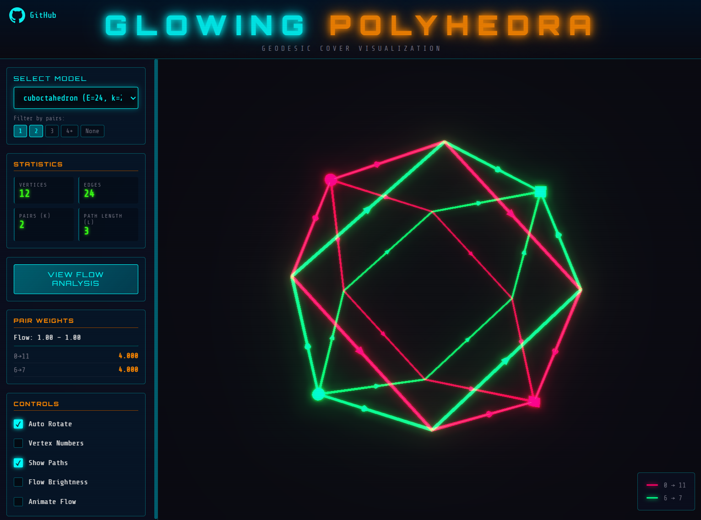

# Glowing Polyhedrons - Geodesic Cover Viewer

Interactive 3D visualization based on three.js of geodesic covers for polyhedra provided in JSON format. This web application displays electrical paths in polyhedra made of LED filaments. This webapp was mostly coded using Opus 4.5.



## Live Demo

Visit: https://cpldcpu.github.io/GlowPoly/

## Features

- **3D Polyhedra Visualization**: View 120+ convex polyhedra with interactive rotation and zoom
- **Flow Analysis**: Shows optimized edge flow distribution with color-coded paths
- **Pair Highlighting**: Each source-target pair is shown in a distinct color

## Usage

### Interaction
- **Rotate**: Left click + drag
- **Pan**: Right click + drag
- **Zoom**: Mouse wheel / Scroll

### Model Selection & Filtering
- **Select Model**: Choose a polyhedron from the dropdown menu.
- **Filter by Pairs**: Use the toggle buttons `[1] [2] [3] [4+] [None]` to filter the list of models based on the number of feeding point pairs in the  solution.

- **Statistics Panel**: Metrics like vertex/edge counts and best configuration values.
- **View Flow Analysis**: Click to open the detailed side panel showing tabulated usage data for every edge.
- **Pair Weights**: Shows the min/max flow range and the driving current for each feeding point pair to achieve a balanced flow. Ideally, you want min/max flow be close to one to avoid brightness variation.

### Controls
The control panel allows you to customize the visualization:
- **Auto Rotate**: Toggle automatic rotation around the object
- **Vertex Numbers**: Show/hide index numbers for all vertices
- **Show Paths**: Toggle visibility of the solution paths (wireframe)
- **Flow Brightness**: Scale edge brightness based on optimized flow weights (brighter edges = current)
- **Animate Flow**: Toggle moving particles to visualize the direction of the paths


## Local Development

1. Clone the repository:
   ```bash
   git clone https://github.com/cpldcpu/GlowPoly.git
   cd GlowPoly/webviewer
   ```

2. Download model data (requires Python):
   ```bash
   python download_models.py
   ```

3. Start a local server:
   ```bash
   python -m http.server 8080
   ```

4. Open http://localhost:8080 in your browser

## Data Sources

- **Polyhedra Models**: Downloaded from [tesseralis/polyhedra-viewer](https://github.com/tesseralis/polyhedra-viewer). Visit their [Polyhedra Viewer](https://polyhedra.tessera.li/) 
- **Geodesic Cover Results**: `data/geodesic_cover_results.json` (computed by the solver in `../solver/poly_solver.py`). Note that the solver current uses a greedy algorithm and does not necessarily find the optimal solution.   

## Deployment

The site is automatically deployed to GitHub Pages via the workflow in `.github/workflows/deploy-pages.yml`. Model data is downloaded at build time from the external repository.

## License

MIT License
